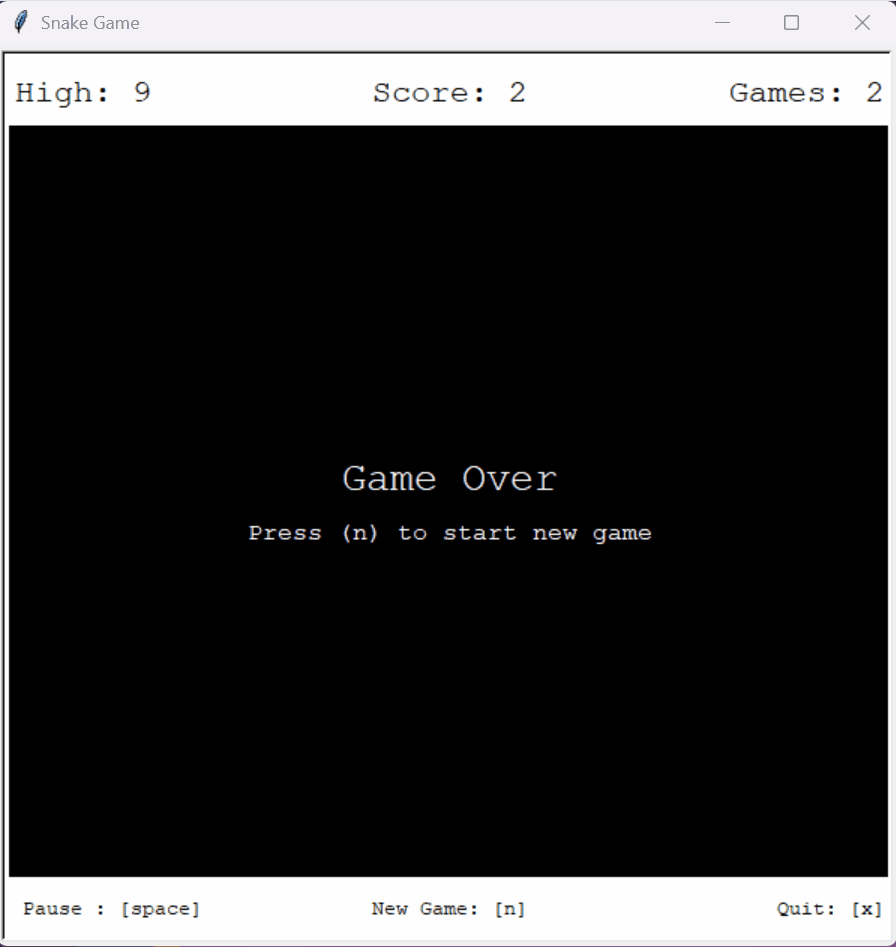

# 🐍 Snake Game (Python Turtle)

> A funt to play Snake game built using Python and Turtle graphics 🎮
> Simple, fun, and nostalgic — now playable on your desktop!

---

## 🎥 Preview




---

## 🕹️ Controls

| Key            | Action     |
| -------------- | ---------- |
| ⬆️ Up Arrow    | Move Up    |
| ⬇️ Down Arrow  | Move Down  |
| ⬅️ Left Arrow  | Move Left  |
| ➡️ Right Arrow | Move Right |
| ❌ Q / ESC     | Quit Game  |
| ▶️ [space]     | Play/Pause |
| 🆕 N           | New Game   |

---

## 🛠️ Tech Stack

* 🐍 Python 3
* 🎨 Turtle Graphics (built-in)

---

## 🚀 How to Run

### ▶️ Option 1: Run from source

```bash
git clone https://github.com/dasatti/snake-game.git
cd snake-game
python main.py
```

---

### 💻 Option 2: Download executable

1. 👉 [Download for Windows](https://drive.google.com/drive/folders/1K8Tg3mvZ4jl_9HKmo--sldaMrZMYj32i?usp=sharing)
2. Extract zip file
3. Double-click .exe and play 🎉

---

## 🧠 Game Rules

* Eat food 🍎 to grow longer
* Don’t hit the wall 🚧
* Don’t collide with yourself 💥
* Try to beat your high score 🏆

---

## ⚡ Future Improvements

* 🎨 Better UI / animations
* 🔊 Sound effects
* 🏆 High score saving
* 🌐 Web version

---

## 🤝 Contributing

Feel free to fork this repo and improve the game!

```bash
git checkout -b feature/your-feature-name
```

---

## ⭐ Support

If you like this project:

👉 Give it a **star ⭐ on GitHub**
👉 Share it with others

---

## 📜 License

This project is open-source and available under the MIT License.

---

## 🙌 Author

Made with ❤️ by **Danish Satti**

PS. Not vibe coded

---
